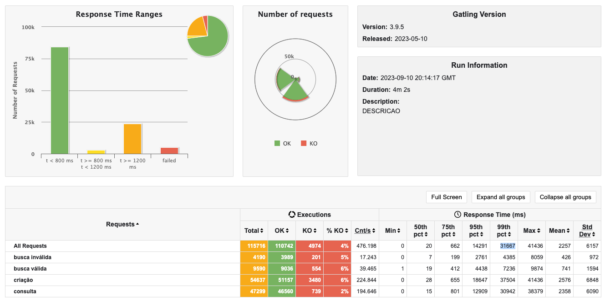

## Desafio da Rinha de Backend

Este repositório contém minha versão em Python do desafio da Rinha de Backend, que aconteceu de 28 de julho a 25 de
agosto de 2023, fora do prazo, mas gostei do desafio e resolvi tentar implementar uma versão em python que chegasse
perto das versões implementadas em linguagens compiladas. A Rinha de Backend foi um torneio onde os participantes
competiram para criar uma API capaz de suportar uma alta carga durante testes de estresse. O objetivo era desenvolver
uma API com endpoints para criar, consultar e buscar informações sobre 'pessoas', seguindo um padrão CRUD, excluindo as
operações de atualização e exclusão.

#### Link da Rinha de Backend

[https://github.com/zanfranceschi/rinha-de-backend-2023-q3](https://github.com/zanfranceschi/rinha-de-backend-2023-q3)

## Tecnologias utilizadas

- Python 3.11
- FastAPI
- Uvicorn
- MongoDB
- Redis

## Resultados obtidos em docker local

- Total de cadastros 47295
- P99 Geral 31667ms (Tive que abrir mão de consistência, mas fiquei bem satisfeito com o resultado, ficadando dentro da
  média dos primeiros colocados. Claro, boa parte do mérito é do MongoDB, que é muito
  performático e na minha opinão, a melhor escolha para o cenário da rinha.)

#### Imagem dos resultados obtidos

 